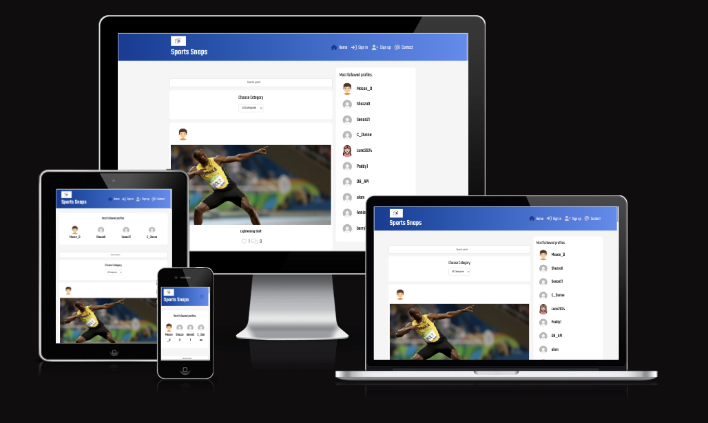
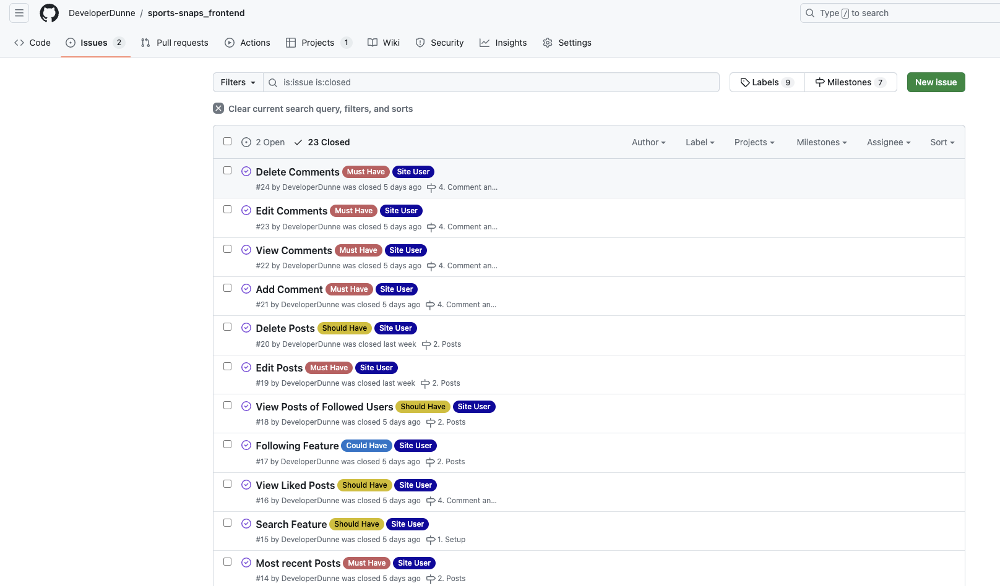
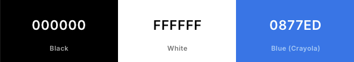
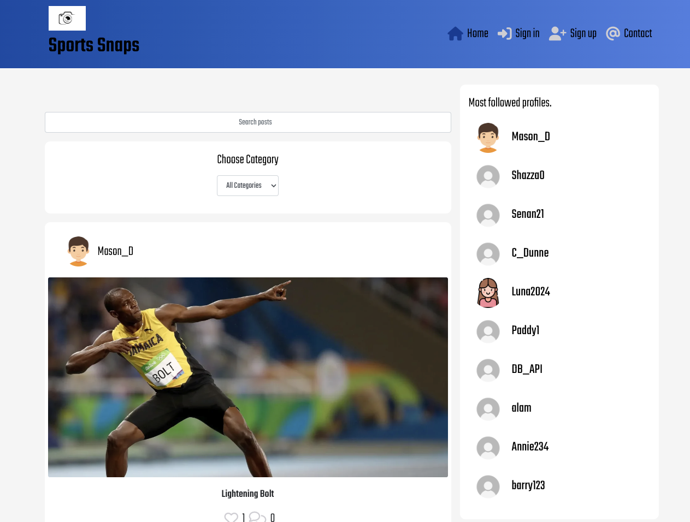
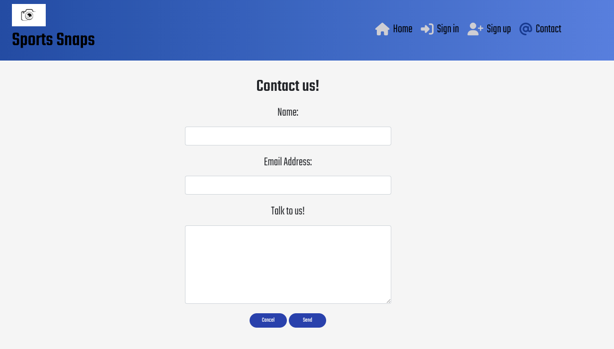
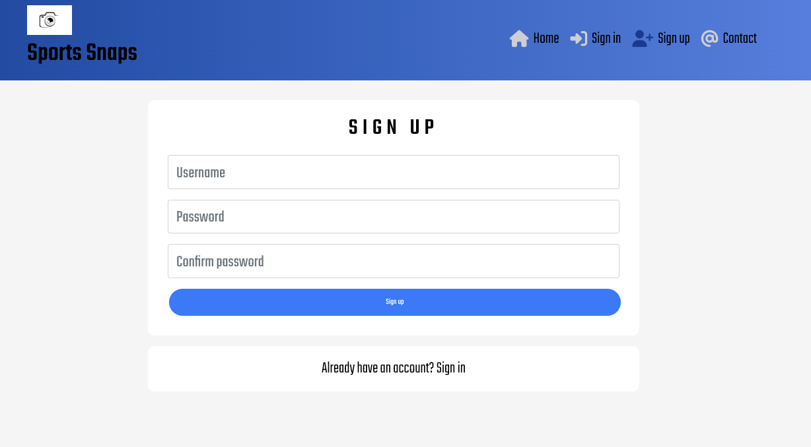
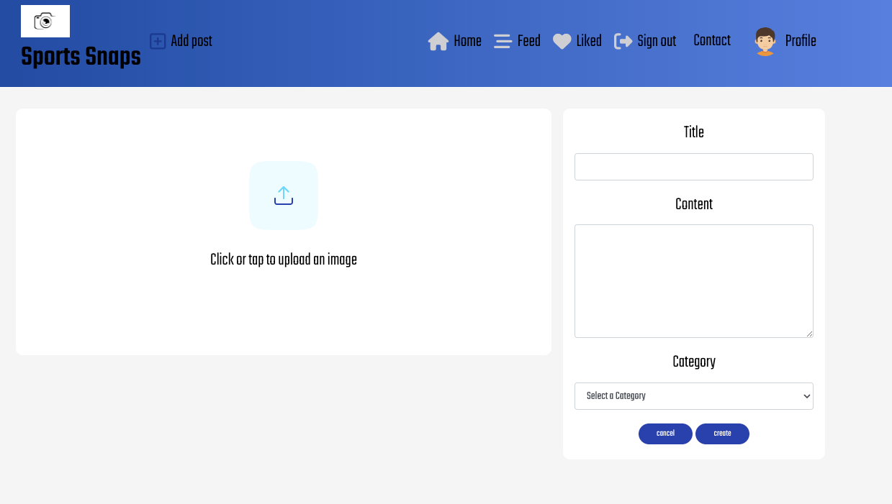
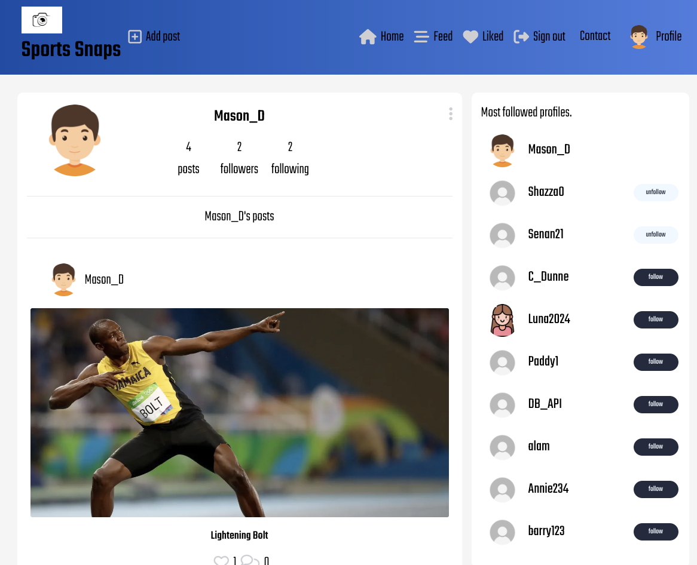

# Sports Snaps - Frontend.

Sports Snaps is a social media platform that lets users post images and share their content with other people. Signed up Members can post pictures, like other posts, comment on posts and also edit and delete their posts. Members can also follow other members to create a personalized feed.

## Live Site

[You can view the live web application here.](https://sportssnaps-37b7ee6411c9.herokuapp.com/)

## Site Repositories

[Frontend Repository](https://github.com/DeveloperDunne/sports-snaps_frontend)

[API Repository](https://github.com/DeveloperDunne/Sports-Snaps-API)

## Table of contents

- [1. User Expeience](#user-experience-ux)
- [2. Agile Methodology](#agile-methodology)
- [3. The Scope](#the-scope)
- [4. Design](#design)
- [5. Features](#features)
- [6. Resusability](#resusability)
- [7. Django Admin](#django-admin)
- [8. Technologies Used](#technologies-used)
- [9. Testing](#testing)
- [10. Deployment](#deployment)
- [11. Credits](#credits)
- [12. Acknowledgements](#acknowledgements)

## User Experience

### User Stories

* As a website user, I can:

 

1. Navigate around the site and easily view the content that has been posted.

2. Comment and like posts to interact with the community.

3. Follow my favorite users.

4. Access a contact page where I can contact the admin if required.

5. Register for an account to access the services offered to authorized members.

 

* As a website superuser, I can:

 

1. Create and publish a new post.

2. Create a new user.

3. Delete users.

4. Approve, reject or delete user's posts or comments.

## Agile Methodology

* All functionality and development of this project were managed using GitHub Projects. This can be found here at [Github Projects](https://github.com/users/DeveloperDunne/projects/6/views/1).

### MoSCoW

This project used the "MoSCoW" method to classify features and requirements according to their importance towards a minimum viable product (MVP). "MoSCoW" stands for "Must have, Should have, Could have and Won't have," with each classification aiding in the prioritization of features. This method makes sure that essential components are tackled in priority order.

## The Scope

### Main Site Goals

* To provide users with a good experience when using the website.
* To provide users with a visually pleasing website that is intuitive and easy to navigate.
* To provide a website with a clear purpose.
* To provide role-based permissions that allow users to interact with the website.
* The ability to contact admin if required.
* The ability to update and delete comments if desired.
* The ability to interact with the community by commenting, following and liking posts.

### Target audience

This blog is for sports fans who are interested in interacting with a like-minded community who share their love for sporting moments captured in pictures.

## Design

### Wireframes
Balsamiq was used to design the blog's look.

### Colour Theme

The colour theme above was used throughout the project to ensure consistency, seem welcoming and appeal to the user. The navigation bar is a gradient to add uniqueness.

### Fonts
The font used was 'Teko'. All fonts were sourced from [Google Fonts](https://fonts.google.com/).

## Features

### Navigation Bar:

A responsive navigation bar is situated at the top of the page. When on a mobile the bar condenses into a burger icon which will enable a dropdown menu, however on a desktop all pages are displayed along the bar. What is shown in the navigation bar depends on whether the user is logged in or not.

### Not logged in:

When not logged in you will be able to see the following pages: Home, Sign In, Sign Up and Contact.

### Logged in:

When logged in the Register and Sign-in page disappears and instead you will see the following.

### Landing Page

Upon arrival to the website, the landing page will be loaded. Here you will be able to see posts that authorized users have already posted drawing you into what is to come.

### Contact Page

The contact page consists of a form that the user can fill out and submit if they have any questions.

### Sign Up Page

This page is a form where the user can sign up to reap the benefits of being a logged in user.

### Sign In Page

This page is where the user can sign in so that they can have access to the benefits of being an authorized user.

### Sign Out Page

Once users click the sign out link they will be redirected to the landing page.

### Add Post Page

Here logged in users can create their own posts to share with the community.

### Feed Page

The feed page will show all of the posts that the registered user has decided to follow.

### Like Page

the Like page will show all of the posts the registered user has liked.

### Profile Page

This page will provide all information about a user. If you are the the user of the profile you have the option to amend details.

### Future Features

Features I would have liked to implement but did not get time to would be a notification feature where authorized users would be notified when someone that they follow posts a new photo.

I would also liked to add more styling to the overall look of the site however I just ran out of time.

## Resusability

React Components

1. **Asset.js:**
 
This component displays a spinner when the page is loading. It can be reused wherever a spinner could be needed, for example when something is loading.
 

-`Const Asset` is a reusable component and has been reused in other componenets to display a spinner when some content is loading.  The spinner was imported from ‘react-bootstrap’. 
 

This was used in:
 

-  NotFound.js
- PostCreateForm.js
- PostPage.js
- PostsPage.js
- PopularProfiles.js
- ProfilePage.js 

 

2. **Avatar.js:**
 
This component arranges the Avatar images for users. It can be reused for whenever a user is added an avatar image is assigned before the user changes the image.

 

-`Const Avatar` is considered a reusable component and has been reused in other components such as:
 

- NavBar.js
- Comment.js
- CommentCreateForm.js
- Post.js
- Profile.js

 

3. **ChooseCategory.js:**
  
This component fetches categories from the API and displays them in a dropdown menu. Once selected this allows users to filter sports based on the selected category. It can be reused in different situations where a drop-down list with filtering for categories is required.

 

-`Const ChooseCategory` is reusable and was reused in ‘PostsPage.js to enable filtering posts via category.
 

4. **MoreDropdown.js:**
 
This component can be reused as a simple dropdown menu for when users need to edit a comment, post or photos.
 

-`Const MoreDropdown` is a reusable component. It has been reused in:
 
- Comment.js
- Post.js
- ProfilePage.js 
 

5. **NotFound.js:**
  
This component displays the image that is displayed when a request can't be found. 

-‘Const NotFound` has been used in App.js inside a path to display a "Not found" message when a user wants to use a path that doesn't exist. It was also given a source of NoResults which has been reused in:
 
- PostsPage.js
- ProfilePage.js 
 

6. **SignInForm.js:**
  
This displays the form for a user to sign in to the website. 

- `Function SignInForm` is a reusable component.
 

7. **SignUpForm.js:**
  
This component enables users to sign up and register an account.
 

-`Const SignUpForm` is a reusable component.
 

8. **Comment.js:**  This component displays a comment with added options to edit or delete it by the user who owns the comment. 
This component can be reused in environments such as blog posts. 

-`Const Comment` is a reusable component and has been reused in
    PostPage.js.
 

9. **CommentCreateForm.js:**
 
This s designed to allow users to create a new comment. .
 

- `Function CommentCreateForm` is a reusable component and was reused in: 

 - PostPage.js 
 

10. **CommentEditForm.js:**
  
This allows users to edit existing comments. It allows the user to update the comment's content and save any changes.
 
This component can be reused in Comment.js and CommentCreateForm.js.
 

- `Function CommentEditForm` is considered a reusable component and has been reused in Comment.js. 

11. **ContactForm.js:**
 
This component is designed for users to reach out and contact the site owner by sending messages through a contact form.
 

- `Const ContactForm` is considered a reusable component. 

12. **Post.js:**
  
This component is quite versatile and can be reused where interacting with posts is required. 
Can be reused in Blogs or forum threads. 

- `Const Post` is considered a reusable component and has been reused in the following: 

- PostPage.js
- PostsPage.js 

13. **PostCreateForm.js:**
  
This component is used to create new posts. It includes form fields for entering a post title, content, an optional image upload, and selecting a category. Users can fill out these fields, upload an image if they want and submit the form to create a new post. 

- `Function PostCreateForm` is a reusable component.

14. **PostEditForm.js:**
  
This component is used to edit forms of posts. Users can edit all fields and resubmit the form to update the post. 

- `Function PostEditForm` is considered a reusable component.

15. **PostPage.js:**
  
This component displays the post content. 

- `Function PostPage` is a reusable component.

16. **PostsPage.js:**
  
This component  displays posts dependant on different filters. 

- `Function PostsPage` can be reused.

17. **PopularProfiles.js:**
  
This component displays all popular profiles. 
Can be used in other applications as i.e a featured section. 

- `Const PopularProfiles` is considered a reusable component and has been reused in: 

  - PostPage.js
- PostsPage.js
- ProfilePage.js 

18. **Profile.js:**
  
This component is designed to display a user profile with options for following or unfollowing.. 

- `Const Profile` is considered a reusable component and was been reused in: 

- PopularProfiles.js 

19. **ProfileEditForm.js:**
  
This component allows a user to edit their profile information. 

- `Const ProfileEditForm` is a reusable component.

20. **ProfilePage.js:**
  
This component displays a user's profile information. This information includes a profile picture, follower counts, and their own posts.  

- `Function ProfilePage` is  a reusable component.

21. **UsernameForm.js:**
 
This component allows users to change their username.
 
- `Const UsernameForm` is a reusable component.

 
22. **UserPasswordForm.js:** 

 
This component allows users to change their password. It integrates with React, React Bootstrap for UI components, and Axios for making HTTP requests.  

- From this component const UserPasswordForm is a reusable component.

## Technologies Used

### Languages Used

* HTML 5
* CSS 3
* JavaScript
* React
* Django-Rest Framework
* Python

### Frameworks & Libraries Used

* React-Bootstrap: This was used to style the website, and add responsiveness and interactivity.

* Git: Was used for version control to commit to Git and push to GitHub.

* GitHub: Is is used to store the project's code after being pushed from Git

* Heroku: Was used to deploy the live project.

* GitHub / VSCode: This was used to create and edit the website.

* Fontawesome: To add icons to the website.

* Google Fonts: To add the fonts that could be used for the project.

* Coolors: To build the colour palette of the project.

* Balsamiq: To build the wireframes for the project.

### Databases

* CI PostgreSQL from Code Institute was used as the PostgreSQL database for this project.

## Testing

Detailed testing documentation can be found here[ TESTING.MD](./TESTING.MD)

## Deployment

All code for this project was written using the IDE Visual Studio code (VS Code) using a Gitpod workspace. Github was used for version control and the application was deployed via Heroku.

 ### Heroku Deployment

* This site was deployed by completing the following steps:

1. Log in to Heroku or create an account.

2. On the main page click Create New App.

3. Select your region.

4. Click on the Create App button.

5. The next page is the project’s Deploy Tab, click the Settings Tab.

6. Go to the Deploy tab.

7. Select Github as your deployment method.

8. Connect to GitHub.

9. Search your repository name and connect.

10. Click either Enable Automatic Deploys for automatic deployment when you push updates to GitHub or manual to do this manually.

### Cloning:

1. Go to the repository on GitHub.

2. Click on the Code button and copy the https URL under Clone.

3. Open a terminal.

4. Go to the folder you want to store the cloned repository.

5. In the terminal type git clone and paste the URL of the cloned repository after it then press Enter.

6. The site will then be cloned to that directory.

### Fork this repository:

- Go to the GitHub repository.
- Click on the Fork button in the upper right-hand corner.

## Credits

### Code
The CI walkthroughs (DRF Rest Framework API & Moments) were leaned on and relied upon heavily in this project due to time restraints, there are still some remnants of legacy code within. As I was really pushed for time to complete the project I used the CI code and initial styling as a base before implementing my own custom features and styles. 

I created a Contact model where users can contact the admin if required by filling out a form and also added a category feature.

## Acknowledgements
Thank you to the Slack community and especially tutors which I relied on a lot for all their help throughout this project. Also thank you to my friends and family for help with testing the project.